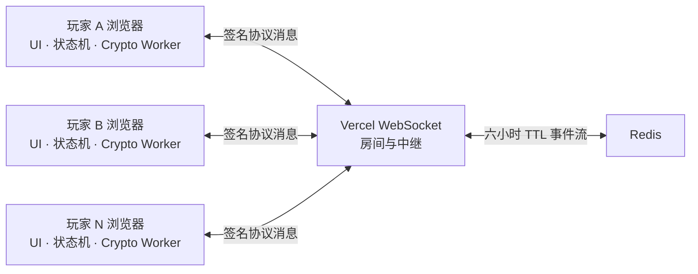

# The Oath of Avalon

一个运行在浏览器中的无中心发牌者阿瓦隆实验。

玩家共同生成随机性、验证事件并在本地推导游戏状态；Vercel 负责提供网页、房间与 WebSocket 消息中继。项目的长期目标是把角色分配、任务秘密票和刺杀约束放进真正的安全多方计算协议中，使服务器只看见加密后的协议消息。

> 本文使用 **MPC（Secure Multi-Party Computation，安全多方计算）**。它不是大模型工具生态中的 MCP（Model Context Protocol）。

线上版本：[gengminqi.com](https://gengminqi.com)

## 为什么阿瓦隆适合 MPC

传统阿瓦隆需要一名主持人或一台可信服务器知道完整角色表、检查秘密任务票并宣布结果。MPC 试图把这个可信角色拆散给所有玩家：

- 没有任何单一设备负责发牌；
- 每名玩家只得到规则允许其看到的信息；
- 服务器不能决定角色、修改有效操作或读取秘密票；
- 所有浏览器从同一条已验证事件流推导相同公共状态；
- 最终只公开任务失败票数量、刺杀结果和终局角色表。

这类游戏的输入很小、参与者只有 5–10 人、计算延迟要求远低于实时动作游戏，因此可以接受 MPC 的额外通信轮次和计算成本。

## 当前状态：可玩的协议脚手架

当前版本已经可以走通房间、角色、组队、表决、任务和刺杀流程，但还不是最终的私密 MPC 实现。

| 能力 | 当前实现 | 安全含义 |
|---|---|---|
| 本地身份 | Web Crypto P-256 ECDSA + P-256 ECDH 密钥 | 私钥保存在 IndexedDB；ECDH 尚未用于消息加密 |
| 事件认证 | ECDSA 签名、发送者序号、前序哈希 | 可发现伪造、修改、重复、缺失和简单分叉 |
| 房间共识 | 玩家名单、公钥和规则生成 genesis 哈希与校验词 | 玩家可口头比对视图是否一致 |
| 角色随机性 | 所有人先承诺随机种子，再公开种子并确定性洗牌 | 没有单一发牌者，但每个客户端最终都能算出完整角色表 |
| 队伍表决 | commit–reveal | 提交阶段隐藏选择，公开阶段所有人可见 |
| 任务表决 | commit–reveal | 当前任务票在 reveal 后公开，不是真正的秘密汇总 |
| JIFF | 浏览器 Worker 可加载 JIFF bundle | 当前角色洗牌仍是普通本地计算，没有使用秘密分享电路 |
| 中继 | Vercel WebSocket + Redis TTL | 中继不计算游戏规则，但当前 `ciphertext` 只是 Base64URL JSON，不是密码学密文 |

因此当前版本能证明“无服务器发牌”和“签名事件驱动游戏”这条产品路径，但不能宣称服务器看不见协议明文，也不能宣称普通客户端只知道自己的角色。

## 系统结构



浏览器负责：

- 创建和保存玩家密钥；
- 验证签名、序号与哈希链；
- 运行角色随机协议；
- 根据公共事件重放确定性游戏状态；
- 保存当前房间的恢复数据；
- 在终局或主动清理时删除房间秘密。

服务器负责：

- 创建六位房间码；
- 保存玩家名称、座位、在线状态和锁定状态；
- 限制消息尺寸与频率；
- 转发协议 envelope；
- 用 Redis 临时保存事件，支持断线重放；
- 在 TTL 到期后清理房间。

## 当前协议的数学原理

### 1. 承诺—公开随机种子

玩家 `i` 在本地生成 256 位随机数 `sᵢ`，先广播承诺：

```text
cᵢ = SHA-256(playerIdᵢ || sᵢ)
```

所有人完成承诺后再公开 `sᵢ`。其他客户端验证：

```text
SHA-256(playerIdᵢ || sᵢ) = cᵢ
```

验证通过的输入按玩家 ID 排序，与房间和 genesis 哈希一起组合：

```text
S = SHA-256(roomId || genesisHash || sorted(cᵢ, sᵢ))
```

`S` 驱动确定性 PRNG 和 Fisher–Yates 洗牌。只要至少一名诚实玩家的随机数在承诺时不可预测，其他人就不能预先指定最终种子。

这个协议仍有 **选择性中止** 问题：玩家看到其他人的 reveal 后可以拒绝公开自己的随机数，使本局无法继续。解决方式通常不是“猜出缺失随机数”，而是中止本局、记录责任方，或采用带惩罚和可恢复分享的更复杂协议。

### 2. 投票承诺

队伍票和任务票目前使用：

```text
C = SHA-256(playerId || scope || choice || salt)
```

其中 `scope` 包含投票类型、任务编号和组队尝试次数，`salt` 是 192 位随机值。它带来三个性质：

1. 隐藏性：在公开前，观察者难以从 `C` 推出 `choice`；
2. 绑定性：玩家难以找到另一组 `choice, salt` 打开同一承诺；
3. 上下文隔离：旧投票不能复制到另一轮。

commit–reveal 只隐藏“提交阶段”的选择。reveal 之后票是公开的，所以它不能替代任务票 MPC。

### 3. 签名 envelope 与哈希链

每条消息对以下规范化字段签名：

```text
protocolVersion, roomId, senderId, recipients,
sequence, previousHash, messageType, ciphertext, sentAt
```

签名使用 ECDSA P-256 / SHA-256。每位发送者拥有独立哈希链：

```text
hᵢ,ₖ = SHA-256(envelopeᵢ,ₖ)
previousHashᵢ,ₖ₊₁ = hᵢ,ₖ
```

签名证明消息来自对应私钥，哈希链帮助发现删除、重排、重复和分叉。它们提供的是完整性与身份认证，不提供机密性；服务器仍然可以读取未加密 payload。

## 目标 MPC 协议设计

以下内容是下一阶段设计，**尚未在当前产品中实现**。

### 1. 有限域与秘密分享

所有秘密先编码到大素数域 `𝔽ₚ`。对秘密 `x`，玩家生成一个 `t` 次随机多项式：

```text
f(z) = x + a₁z + a₂z² + ... + aₜzᵗ  mod p
```

第 `j` 名玩家只收到份额：

```text
[x]ⱼ = f(j)
```

任意 `t + 1` 个份额可用拉格朗日插值恢复 `f(0) = x`；至多 `t` 个串谋玩家从自己的份额中得不到关于 `x` 的信息。

半诚实模型下需要 `n > 2t` 才能方便地完成乘法和降阶，第一版可选择：

```text
t = floor((n - 1) / 2)
```

如果升级到带主动攻击者的 BGW 类安全模型，则通常需要 `n > 3t`。即使数学阈值允许恢复，产品层仍可以规定任意玩家掉线就暂停或终止本局。

秘密分享对加法天然友好：

```text
[x + y]ⱼ = [x]ⱼ + [y]ⱼ
[αx]ⱼ = α[x]ⱼ
```

每名玩家只在自己的份额上计算，结果仍然是正确输出的秘密份额。

### 2. Beaver 三元组与安全乘法

比较、角色约束和布尔判断都需要秘密乘法。预先准备秘密分享的随机三元组：

```text
[a], [b], [c]，其中 c = ab
```

要计算 `[xy]`，公开两个被随机数遮蔽的差：

```text
d = x - a
e = y - b
```

然后每名玩家计算：

```text
[xy] = [c] + d[b] + e[a] + de
```

公开的 `d, e` 不泄漏 `x, y`，因为 `a, b` 是一次性随机掩码。最终实现必须由玩家共同产生三元组，不能让 Vercel 充当可信 `crypto_provider`。

### 3. 私密角色洗牌

角色列表是公开的，但“哪个座位得到哪个角色”必须保持秘密。

一种适合 5–10 人小规模房间的方案：

1. 每名玩家为每张角色牌贡献随机域元素 `rᵢ,ⱼ`；
2. MPC 内计算秘密随机键 `[Rⱼ] = Σᵢ [rᵢ,ⱼ]`；
3. 将公开角色编码和秘密随机键组成 `(Rⱼ, roleⱼ)`；
4. 使用固定拓扑的 bitonic sorting network 做秘密比较与交换；
5. 排序后的角色编码始终保持为秘密份额；
6. 第 `j` 个角色只向第 `j` 名玩家定向打开。

只要一名玩家贡献均匀随机值，每个 `Rⱼ` 都不可由其他参与者预先控制。若使用至少 128 位随机键，碰撞概率近似满足：

```text
Pr[collision] ≤ n(n - 1) / 2¹²⁹
```

秘密 compare-and-swap 可写成：

```text
[b] = [Rₐ < Rᵦ]
[left]  = [b]·[cardₐ] + (1 - [b])·[cardᵦ]
[right] = [b]·[cardᵦ] + (1 - [b])·[cardₐ]
```

固定排序网络不会通过分支路径泄漏比较结果。Merlin 的视野、邪恶阵营互认等信息也在 MPC 内根据秘密角色位计算，只向有权限的玩家打开对应结果。

### 4. 私密任务票汇总

令：

- `vᵢ ∈ {0,1}`：玩家提交的失败票；
- `eᵢ ∈ {0,1}`：该玩家是否属于邪恶阵营；
- `mᵢ ∈ {0,1}`：该玩家是否在当前任务队伍中，属于公共信息。

先验证输入是布尔值：

```text
[vᵢ]([vᵢ] - 1) = 0
```

再在秘密状态中强制好人无法投失败：

```text
[fᵢ] = mᵢ · [eᵢ] · [vᵢ]
```

只公开总失败票：

```text
F = open(Σᵢ [fᵢ])
```

任何单个 `vᵢ`、`eᵢ` 和 `fᵢ` 都不公开。任务是否失败由公共阈值判断：

```text
failed = F ≥ threshold(quest, playerCount)
```

7 人及以上的第四次任务使用阈值 2，其他任务使用阈值 1。

### 5. 私密刺杀约束

令 `[aᵢ]` 表示玩家 `i` 是否为 Assassin，`tᵢ,ⱼ` 是玩家 `i` 提交的 one-hot 目标向量。MPC 只让真正刺客的输入生效：

```text
[targetⱼ] = Σᵢ [aᵢ] · [tᵢ,ⱼ]
```

若 `[mⱼ]` 表示座位 `j` 是否为 Merlin，则命中结果为：

```text
[hit] = Σⱼ [targetⱼ] · [mⱼ]
```

协议最终只公开被选择的目标和 `hit`，不会提前公开 Assassin 或 Merlin 的角色位。

### 6. 加密 MPC 传输

当前浏览器已经生成 P-256 ECDH 密钥，但还未使用。目标设计为每对玩家派生独立会话密钥：

```text
Zᵢⱼ = ECDH(skᵢ, pkⱼ)
Kᵢⱼ = HKDF-SHA256(Zᵢⱼ, roomId || genesisHash || protocolVersion)
```

每个秘密份额使用 AES-GCM 单独加密给接收者，nonce 绑定发送者序号和协议轮次。签名覆盖完整密文与路由字段，实现“先加密、后签名”。届时 Vercel 和 Redis 只能看到发送者、接收者、时间、长度和密文，不能读取份额内容。

## 威胁模型与边界

第一目标是半诚实安全：玩家按协议执行，但可能分析自己看到的所有消息。后续再逐步处理主动攻击者。

即使完成上述 MPC，系统仍无法解决：

- 玩家截图、共享屏幕或线下透露角色；
- 中继延迟、丢弃消息或让游戏不可用；
- 玩家在关键轮次选择性掉线；
- Vercel 被攻陷后向浏览器下发恶意新版前端；
- 浏览器、扩展、设备或依赖供应链被控制；
- 超过阈值的玩家串谋恢复秘密。

抵抗主动作弊还需要可验证秘密分享、份额一致性检查、消息认证码或 SPDZ 类协议。项目在完成独立审计和恶意模型实现前，不应使用“完全无信任”“无法作弊”或“经过证明绝对安全”等表述。

## 实现路线

### 已完成

- 响应式首页与房间界面；
- 5–10 人房间、锁房与在线状态；
- WebSocket 中继和 Redis 重放；
- 浏览器本地身份与签名 envelope；
- 每发送者序号和哈希链；
- genesis 校验词；
- 角色种子 commit–reveal 与确定性发牌；
- 队伍与任务票 commit–reveal；
- 完整阿瓦隆状态机和刺杀结算；
- IndexedDB 恢复与秘密清理；
- 自动化协议测试。

### 下一阶段

1. 用 ECDH + HKDF + AES-GCM 替换 Base64URL payload；
2. 设计并测试浏览器间点对点秘密份额消息；
3. 用 JIFF 真正执行 Shamir 分享和客户端共同预处理；
4. 实现秘密角色洗牌，只向本人打开角色；
5. 实现只公开失败票总数的任务票 MPC；
6. 把刺杀身份约束移入 MPC；
7. 增加恶意输入、掉线和选择性中止测试；
8. 进行协议审计、性能基准和多设备兼容验证。

## 本地运行

需要 Node.js、pnpm 和支持 Web Crypto、IndexedDB、Web Worker 的现代浏览器。

```bash
pnpm install
pnpm dev
```

打开 `http://localhost:3000`。没有 Redis 时，本地开发会退回进程内房间存储；进程重启后房间消失。

验证项目：

```bash
pnpm test
pnpm typecheck
pnpm lint
pnpm build
```

## 主要目录

```text
app/                         首页、房间 UI、Vercel API
lib/crypto/                  编码、本地密钥与 IndexedDB
lib/game/                    纯 TypeScript 阿瓦隆状态机
lib/protocol/                genesis、签名、角色和游戏协议
lib/relay/                   房间、WebSocket 和 Redis 中继
workers/                     浏览器密码学 Worker
tests/                       游戏、签名、角色与中继测试
docs/                        各实现阶段说明
```

## 许可证与安全声明

这是一个密码学原型和游戏项目，不是经过形式化验证或第三方审计的安全产品。不要把它用于承载真实资金、身份凭证或其他高价值秘密。
